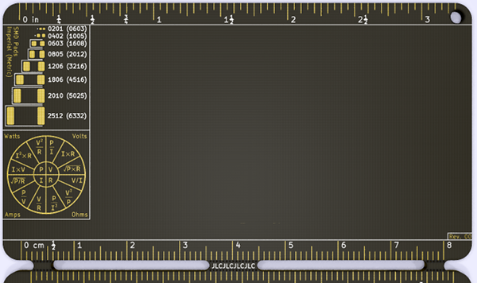
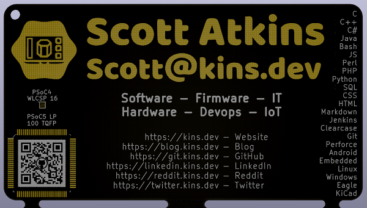
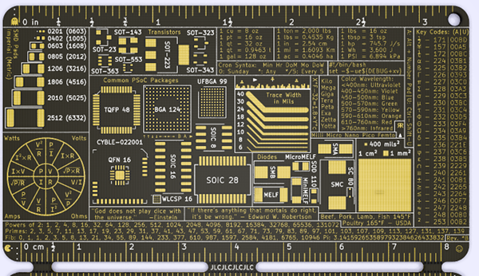

# PCB-Card

<!-- markdownlint-disable MD033 -->
<!-- markdownlint-disable MD034 -->
 PCB Card by <a xmlns:cc="http://creativecommons.org/ns#" href="mailto://scott@kins.dev" property="cc:attributionName" rel="cc:attributionURL">Scott Atkins</a> is licensed under a <a rel="license" href="http://creativecommons.org/licenses/by-sa/4.0/">Creative Commons Attribution-ShareAlike 4.0 International License</a>. Based on a work at <a xmlns:dct="http://purl.org/dc/terms/" href="https://git.kins.dev/PCB-Card" rel="dct:source">https://git.kins.dev/PCB-Card</a>. Permissions beyond the scope of this license may be available by contacting <a xmlns:cc="http://creativecommons.org/ns#" href="mailto://scott@kins.dev" rel="cc:morePermissions">Scott@kins.dev</a>.
<!-- markdownlint-enable MD034 -->
<!-- markdownlint-enable MD033 -->

This is a template to work from.  Fork this project and make it your own.

## Examples

Here's a rendering of the template:

The other side is completely blank.

Here's the rendering of my latest card:

## Resources

### QR Codes

You may want to use [https://www.qrcode-monkey.com/](https://www.qrcode-monkey.com/) for generating QR codes.  There is more flexibility in the dot style and it is easy to put in a logo in the middle of the QR code.

*Please Note: QR codes require a light background and dark dots.  If using a white silk screen be sure to invert the QR code and leave a border around it.*

### PCB Manufacturing

This template is already setup for [JLCPCB](https://jlcpcb.com/).  Silk screen text must be at least 6 mils thick and solder mask can be much smaller.  Additionally I found [JLCPCB](https://jlcpcb.com/) had the best price for 0.4 mm thick boards with ENIG processing.  If you use another thickness (0.6 mm for example) make sure you use ENIG or HASL Lead Free processing.  ENIG looks the best.  Finally [JLCPCB](https://jlcpcb.com/) allows you to specify where the tracking number goes on your board.  That is part of this template.  If you use another board house, they may put the ID number somewhere undesirable.
